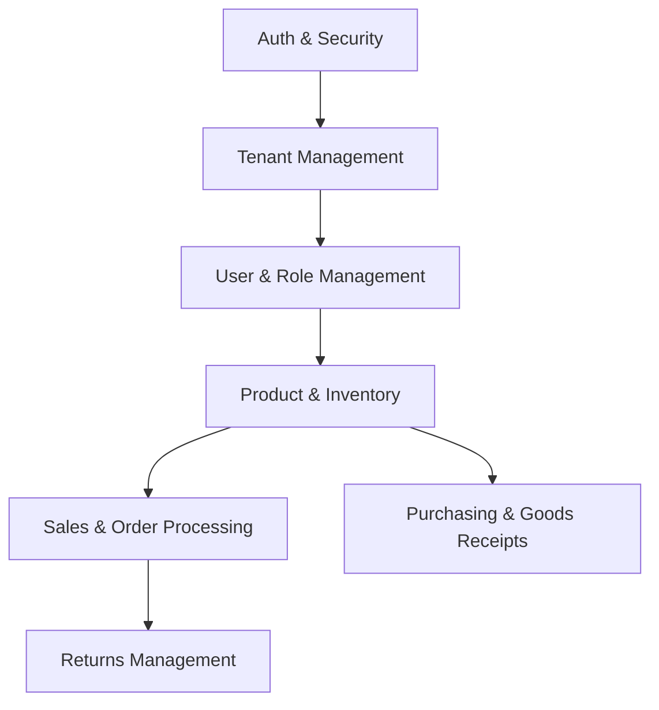

# Product Development Requirements (PDR) & Project Overview

This document outlines the product requirements, context, and core modules of the Multi-Tenant Sales Management System.

## 🎯 Product Vision
To provide retail businesses and enterprises with a secure, highly modular, and performant SaaS platform to manage their multi-location sales, inventories, purchasing, and customer loyalty programs. The platform ensures strict multi-tenant isolation, allowing multiple independent companies (tenants) to operate securely within the same shared database infrastructure.

---

## 👥 Target Users & Roles
1. **System Administrator (Global)**: Configures global tenants, monitors platform health, and manages subscription statuses.
2. **Tenant Admin**: Manages tenant-specific users, roles, warehouses, and global business settings.
3. **Sales Agent**: Manages customers, creates sales orders, issues invoices, and handles customer returns.
4. **Warehouse Operator**: Manages products, updates inventory stock, handles goods receipts, and tracks product variants.

---

## ⚙️ Core Modules

### 1. Multi-Tenant Administration
- Register and configure tenants.
- Enable or disable tenant accounts dynamically (e.g., active, suspended).
- Runtime isolation of all database entities via tenant ID validation.

### 2. Authentication & Authorization (RBAC)
- Username/password and JWT-based authentication.
- Sliding-session refresh token rotation to secure against token hijacking.
- Login rate-limiting protection to prevent brute force attacks.
- Specific permissions allocated to custom user roles.

### 3. Product & Inventory Catalog
- Support for products with multiple variants (attributes like color, size, price).
- Dynamic category trees.
- Image management per product.
- Real-time stock levels tracking across different warehouses.
- Automated inventory transaction logging (stock in, stock out, stock adjustments).

### 4. Sales Orders
- Transactional sales order creation.
- Live customer loyalty point tracking and calculations.
- Application of order item discounts.
- Automated updates to stock levels upon sales execution.

### 5. Procurement & Returns
- Purchase orders to track vendor commitments.
- Goods receipts to record warehouse incoming stock.
- Return orders processing with inventory restocking or damage classification.
