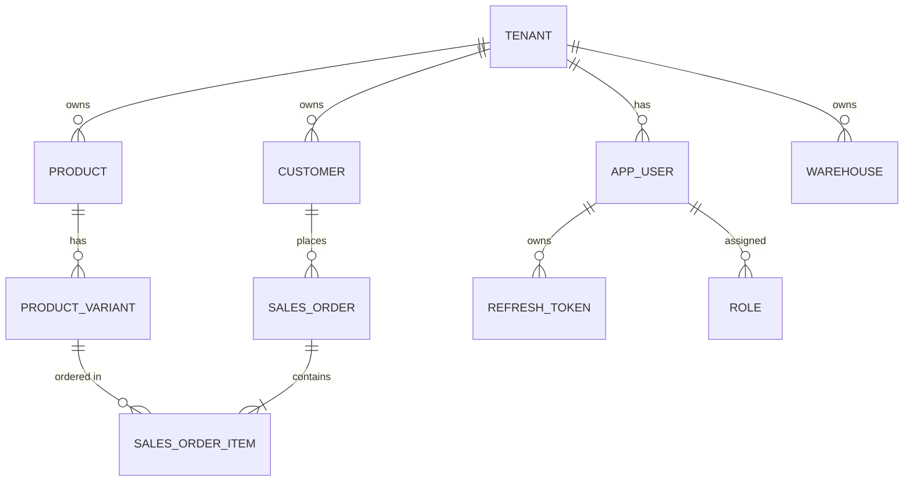

# System Architecture

This document details the architectural layout, security design, and data flows of the Multi-Tenant Sales Management System.

---

## 🏗️ Architectural Overview

The application is structured as a monolithic Spring Boot backend communicating with a Microsoft SQL Server database. It leverages logical tenant separation to keep tenants' data isolated within a single database schema.

---

## 🔒 Security & Tenant Isolation Model

```
[ Client Request ]
       │  (Bearer token in Header)
       ▼
[ JwtAuthenticationFilter ]
       │  1. Extract JWT & Validate
       │  2. Load User details from Database
       │  3. Bind User Authentication to SecurityContext
       │  4. Extract tenant_id -> TenantContext (ThreadLocal)
       ▼
[ REST Controller ]
       │  (Executes under TenantContext)
       ▼
[ Business Service ]
       │  (Invokes DB queries, business checks)
       │  Check: TenantSecurityUtil.verifyTenantAccess(entityTenantId)
       ▼
[ JPA Repository ]
       │  (Loads/Saves Tenant-bound entity)
       ▼
[ SQL Server Database ]
```

### Tenant Isolation Design
Every tenant-scoped entity (e.g. `Product`, `Customer`, `SalesOrder`, `Warehouse`) contains a foreign key pointing to the `tenant` table:
- Data filtering is guaranteed at the service layer by calling `TenantSecurityUtil.verifyTenantAccess(entity.getTenant().getId())`.
- In future iterations, Hibernate `@Filter` or Spring Data JPA custom specifications can be integrated to automate query filters based on `TenantContext.getTenantId()`.

---

## 📊 Database Relationship Model (JPA Entities)

Here is a simplified relationship overview of the core entity structure:



### Core Entities:
- **Tenant**: The SaaS client identifier.
- **AppUser**: A member under a tenant. Tied to a specific `Tenant` and assigned a `Role` (e.g. `ROLE_ADMIN`, `ROLE_SELLER`).
- **Product**: Goods catalog defined by the tenant. Includes details like `name`, `sku`, `category`.
- **ProductVariant**: Holds concrete items for sale (color, size, sell price, buy price).
- **Inventory**: Tracks available quantity of a `ProductVariant` in a specific `WareHouse`.
- **SalesOrder**: Represents a purchase transaction containing multiple `SalesOrderItem`s.
